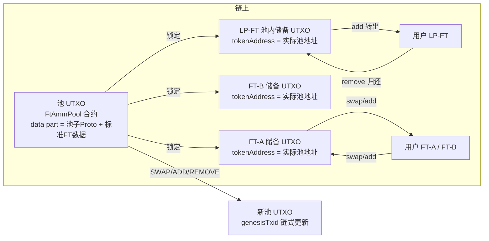

# MCP02 AMM FT-FT 交易合约设计文档（方案 A v2.0）

> 版本：v2.0（v1.2 基础上重构状态模型与索引兼容方式）  
> 日期：2026-08-27  
> 状态：设计定稿（待代码落地）  
> 范围：基于 MCP02 FT 协议的恒定乘积 AMM（FT-FT），LP 份额采用「普通 MCP02 FT + 固定总量预铸 + 池内自持 LP 储备」模型。

## v2.0 相对 v1.2 的核心变化

| 项 | v1.2 | v2.0 |
|---|---|---|
| 池地址 | 固定地址、无状态 | **有状态池 UTXO，地址随 data part 迁移** |
| 状态载体 | 池地址下 FT UTXO 的 `tokenAmount` | **池 UTXO data part（池子 Proto）** |
| 池 UTXO 更新 | 脚本不变 | **TokenGenesis 链式更新（Backtrace 回溯）** |
| 检索键 | 固定池地址 | **tokenAddress = 官方固定地址（不可变）** |
| 索引器兼容 | 需要识别 AMM 类型 | **池 UTXO 伪装为标准 FT（protoType=1），现有索引器直接可找回** |
| 业务层状态读取 | 读池地址下 FT 金额 | **从 txHex 解析池 UTXO 的池子 Proto** |
| 防伪造池 | 依赖地址唯一 | **Backtrace 链锚定 CREATE_POOL，伪造 UTXO 无法通过** |

---

## 目录

1. [概述](#1-概述)
2. [设计目标与取舍](#2-设计目标与取舍)
3. [总体方案](#3-总体方案)
4. [状态模型](#4-状态模型)
5. [LP-FT 发行与池子初始化](#5-lp-ft-发行与池子初始化)
6. [AMM 数学](#6-amm-数学)
7. [FtAmmPool 合约设计](#7-ftammpool-合约设计)
8. [交易布局](#8-交易布局)
9. [与 MCP02 现有组件的复用](#9-与-mcp02-现有组件的复用)
10. [安全模型](#10-安全模型)
11. [索引与找回](#11-索引与找回)
12. [边界条件与异常处理](#12-边界条件与异常处理)
13. [限制与后续演进](#13-限制与后续演进)
14. [实现路线](#14-实现路线)

---

## 1. 概述

本方案在 **MCP02（Meta Contract Protocol 02 / FT）** 基础上设计一个 **FT ↔ FT 的 AMM 自动做市合约**：

- 交易对由两种普通 MCP02 FT（FT-A、FT-B）组成；
- 定价采用恒定乘积公式 `x·y = k`；
- **SWAP 收取手续费（默认 `feeBps = 30`，即 0.3%），手续费直接留在池中，作为 LP 收益**；
- 支持 `CREATE_POOL`、`ADD_LIQUIDITY`、`REMOVE_LIQUIDITY`、`SWAP` 四种操作；
- **LP 份额本身也是普通 MCP02 FT**（LP-FT），可被标准钱包/浏览器识别、可转账、可挂单交易。

v2.0 的核心思路：

1. **池状态（reserveA / reserveB / lpReserve）写入池 UTXO 的 data part**，每次操作生成新的池 UTXO，地址随状态迁移；
2. **池 UTXO 采用 TokenGenesis 的链式更新模式**：`genesisTxid` 锚定 CREATE_POOL outpoint，每次更新通过 `Backtrace.verify` 回溯，防止伪造池 UTXO；
3. **池 UTXO 的 data part 同时包含一份标准 MCP02 FT 数据**（末尾 172 字节），`tokenAddress` 固定为官方指定地址，现有索引器可以把它当作普通 FT 找回；
4. **池子专用状态（reserveA/B/lpReserve）放在标准 FT 数据前面**，索引器不识别，业务层从 txHex 解析。

---

## 2. 设计目标与取舍

### 2.1 目标

| 编号 | 目标 |
|---|---|
| G1 | 两种任意 MCP02 FT 之间可自由兑换，价格由链上恒定乘积公式自动决定 |
| G2 | 任何人可添加/移除流动性，无需信任第三方 |
| G3 | LP 份额是标准 MCP02 FT，可在二级市场流通 |
| G4 | 池内资产安全由链上合约强制，不依赖业务方/索引器/运营方 |
| G5 | 尽可能复用现有 MCP02 组件（Token、TokenUnlockContractCheck、TokenProto、Backtrace 等） |
| G6 | 现有索引器无需改动即可找回池 UTXO（通过官方 tokenAddress） |

### 2.2 关键取舍

| 取舍点 | 选择 | 原因 |
|---|---|---|
| 定价模型 | 恒定乘积 `x·y = k` | 简单、成熟（Uniswap V2 风格），适合链上整数运算 |
| 手续费 | SWAP 收取 `feeBps`（默认 30 = 0.3%），直接留在池中 | 为 LP 提供收益；ADD/REMOVE 不收手续费 |
| LP 份额形态 | 普通 MCP02 FT | 可被标准工具识别、可转让 |
| LP 发行方式 | 固定总量预铸 + 池内自持 | 避免改造 TokenGenesis，保持 permissionless 添加流动性 |
| 流动性铸造/回收 | add=池子转出 LP，remove=用户归还并合并回池内储备 | 用普通 FT 转账语义模拟 Uniswap 的 mint/burn |
| 初始 LP 计算 | CREATE_POOL 内建初始流动性：`ΔL = min(inA, inB)` | 避免链上开方 |
| 添加流动性比例 | 严格等比例 | 避免“多退少补” |
| 最小储备 | 合约强制 `reserveA/reserveB >= minReserve` | 防“微小池”份额操纵 |
| 池状态载体 | **池 UTXO data part** | 状态唯一、可验证、防储备歧义 |
| 池 UTXO 更新 | **TokenGenesis 链式更新 + Backtrace** | 防伪造池 UTXO，链可追踪 |
| 索引兼容 | **池 UTXO 伪装为标准 FT（protoType=1）** | 现有索引器零改动可找回 |
| 检索键 | **tokenAddress = 官方固定地址** | 稳定、简单、与池状态无关 |
| 池子状态读取 | 业务层从 txHex 解析池子 Proto | 索引器不需要理解池语义 |
| 池 UTXO satoshi 面值 | 不保护（MVC dust = 1 sat） | 池输出只需 >= 1 sat 即可持续使用 |

---

## 3. 总体方案



- **池 UTXO**：`FtAmmPool` 合约输出，data part 包含池子 Proto（reserveA/B/lpReserve）+ 标准 FT 数据（官方 tokenAddress、genesisHash/genesisTxid）。
- **池内 FT 储备**：三枚普通 MCP02 FT UTXO（FT-A/B/LP），`tokenAddress = 实际池地址`（当前池 UTXO 的脚本 hash）。
- **用户侧**：普通 FT 持有，无特殊合约。
- **每次操作**：花费旧池 UTXO + 旧储备 FT，输出新池 UTXO（data part 更新）+ 新储备 FT + 用户 FT + change。

---

## 4. 状态模型

### 4.1 池 UTXO（有状态）

**构造参数（不可变，写入 code part）**

| 字段 | 类型 | 说明 |
|---|---|---|
| `tokenACodeHash` | bytes(20) | FT-A 的 `TokenProto.getScriptCodeHash` |
| `tokenAID` | bytes(20) | FT-A 的 `TokenProto.getTokenID` |
| `tokenBCodeHash` | bytes(20) | FT-B 的 `TokenProto.getScriptCodeHash` |
| `tokenBID` | bytes(20) | FT-B 的 `TokenProto.getTokenID` |
| `lpTokenCodeHash` | bytes(20) | LP-FT 的 `TokenProto.getScriptCodeHash` |
| `lpTokenID` | bytes(20) | LP-FT 的 `TokenProto.getTokenID` |
| `lpTotalSupply` | int | LP-FT 链上总发行量（固定，如 `S`），必须 > 0 |
| `minReserve` | int | 最小储备阈值（A/B 共用） |
| `feeBps` | int | swap 手续费率（基点），默认 30；`0 <= feeBps < 10000` |
| `officialAddress` | bytes(20) | 官方固定地址，用于索引器找回；**不可变** |

**data part（可变）**

```
[池子 Proto]
  reserveA   (8, LE)
  reserveB   (8, LE)
  lpReserve  (8, LE)

[标准 MCP02 FT 数据（末尾 172 字节，供现有索引器识别）]
  tokenName(40) tokenSymbol(20) decimal(1)
  tokenAddress(20) = officialAddress（固定）
  tokenAmount(8)   = 任意值（建议 lpReserve）
  genesisHash(20)  = hash160(新池脚本)（链式更新）
  genesisTxid(36)  = CREATE_POOL outpoint（首次操作后固定）
  protoVersion(4)=1 protoType(4)=1 PROTO_FLAG(12) dataLen(4) version(1)
```

**池地址**：

```
池地址 = hash160(完整锁定脚本) = hash160(FtAmmPool code + 池子Proto + 标准FT数据)
```

由于池子 Proto 随状态变化，**池地址每次操作都会变化**。

### 4.2 池内 FT 储备 UTXO

- FT-A 储备：`tokenAddress = 当前池地址`，`tokenAmount = reserveA`；
- FT-B 储备：`tokenAddress = 当前池地址`，`tokenAmount = reserveB`；
- LP-FT 池内储备：`tokenAddress = 当前池地址`，`tokenAmount = lpReserve`。

### 4.3 用户侧 LP-FT UTXO

- 普通 MCP02 FT，`tokenAddress = 用户地址`，`tokenAmount = 用户持有的份额`。

### 4.4 不变式

```
reserveA * reserveB >= k_initial                 // swap 后 k 不减少
lpReserve + 流通 LP 总量 == lpTotalSupply          // 固定总量守恒
池 UTXO 的 tokenAddress == officialAddress         // 官方地址不可变
池 UTXO 的 genesisTxid 链式锚定 CREATE_POOL        // Backtrace 可回溯
池内储备 FT 的 tokenAddress == 当前池地址           // 由池合约强制
可变状态（reserveA/reserveB/lpReserve）只存在于池 UTXO data part
```

---

## 5. LP-FT 发行与池子初始化

### 5.1 发行 LP-FT

1. `FtManager.genesis(...)` 创建 LP-FT 的 genesis；
2. `FtManager.mint(...)` 一次性铸造固定总量 `S`，`allowIncreaseMints = false`；
3. 全部 `S` 由池子创建者持有，在 CREATE_POOL 交易中一次性作为输入使用。

### 5.2 创建池子（CREATE_POOL）

CREATE_POOL 不花费池合约 UTXO，只使用普通 FT 转账（`Token.unlock(OP_TRANSFER)` + `TokenTransferCheck`）。

```
输入：
  0: 创建者 FT-A UTXO（amount = inA）
  1: 创建者 FT-B UTXO（amount = inB）
  2: 创建者 LP-FT UTXO（amount = S）
  3: 矿工费 P2PKH（SPACE）
  4: TokenTransferCheck_A
  5: TokenTransferCheck_B
  6: TokenTransferCheck_LP

输出：
  0: 初始池 UTXO（FtAmmPool，data part：池子Proto + 标准FT数据）
      - reserveA = inA, reserveB = inB, lpReserve = S - ΔL
      - tokenAddress = officialAddress
      - genesisHash = b'00'*20
      - genesisTxid = b'00'*36        ← 首次为 0，首次操作时锚定
  1: FT-A 储备 UTXO（池地址, amount = inA）
  2: FT-B 储备 UTXO（池地址, amount = inB）
  3: LP-FT 池内储备 UTXO（池地址, amount = S - ΔL）
  4: 创建者 LP-FT（amount = ΔL）
  5: SPACE 找零
```

初始 `ΔL = min(inA, inB)`，要求 `inA/inB >= minReserve`、`ΔL > 0`、`ΔL <= S`。

---

## 6. AMM 数学

以下全部为**整数运算**，除法向下取整。

### 6.1 SWAP（A → B）

```
inA  = 用户投入 FT-A 数量
reserveA_old, reserveB_old = 旧储备（池 UTXO data part）
feeBps = 池子构造参数

扣费后的有效输入：
  effectiveInA = inA * (10000 - feeBps) / 10000

用户获得输出：
  outB = reserveB_old * effectiveInA / (reserveA_old + effectiveInA)

新储备：
  reserveA_new = reserveA_old + inA
  reserveB_new = reserveB_old - outB

合约校验：
  inA > 0
  effectiveInA > 0
  outB > 0
  reserveA_old >= minReserve
  reserveB_old >= minReserve
  reserveB_new > 0
  (reserveA_old + effectiveInA) * reserveB_new >= reserveA_old * reserveB_old
```

对称地，B → A 交换 A/B 角色。

### 6.2 ADD_LIQUIDITY

```
等比例约束：
  inA * reserveB_old == inB * reserveA_old

LP 铸造量（池子转出量）：
  ΔL = min(inA * lpTotalSupply / reserveA_old,
           inB * lpTotalSupply / reserveB_old)

要求 ΔL > 0 且 ΔL <= lpReserve_old

新状态：
  reserveA_new = reserveA_old + inA
  reserveB_new = reserveB_old + inB
  lpReserve_new = lpReserve_old - ΔL
```

### 6.3 REMOVE_LIQUIDITY

```
lpReturn = 用户归还的 LP-FT 数量

要求：
  lpReturn > 0
  lpReturn <= lpTotalSupply - lpReserve_old

用户获得：
  outA = lpReturn * reserveA_old / lpTotalSupply
  outB = lpReturn * reserveB_old / lpTotalSupply

要求 outA > 0 且 outB > 0

新状态：
  reserveA_new = reserveA_old - outA
  reserveB_new = reserveB_old - outB
  lpReserve_new = lpReserve_old + lpReturn
```

> 溢出防护：所有乘法必须保证结果在 sCrypt `int`（64 位）范围内。

---

## 7. FtAmmPool 合约设计

### 7.1 合约概要

```scrypt
import "tokenProto.scrypt";
import "../backtrace.scrypt";

contract FtAmmPool {
    // 构造参数（code part，不可变）
    bytes tokenACodeHash;
    bytes tokenAID;
    bytes tokenBCodeHash;
    bytes tokenBID;
    bytes lpTokenCodeHash;
    bytes lpTokenID;
    int lpTotalSupply;
    int minReserve;
    int feeBps;
    bytes officialAddress;

    static const int OP_SWAP = 1;
    static const int OP_ADD = 2;
    static const int OP_REMOVE = 3;

    public function unlock(
        SigHashPreimage txPreimage,
        bytes prevouts,
        int op,
        // 池内储备 token 输入（金额即当前 reserve，需与 data part 一致）
        bytes oldTokenAScript,
        bytes oldTokenBScript,
        bytes oldLpScript,
        TxOutputProof proofA,
        TxOutputProof proofB,
        TxOutputProof proofLp,
        int reserveAInputIndex,
        int reserveBInputIndex,
        int lpInputIndex,
        // 用户输入
        bytes userTokenScriptA,
        bytes userTokenScriptB,
        TxOutputProof userProofA,
        TxOutputProof userProofB,
        int userInputIndexA,
        int userInputIndexB,
        int amountAIn,
        int amountBIn,
        bytes userAddress,
        int amountAOut,
        int amountBOut,
        int lpMint,
        int lpReturn,
        // 输出索引
        int poolUtxoOutIndex,
        int reserveAOutIndex,
        int reserveBOutIndex,
        int lpReserveOutIndex,
        int userAOutIndex,
        int userBOutIndex,
        int lpUserOutIndex,
        bytes changeOutput,
        int lpReturnInputIndex,
        bytes oldLpUserScript,
        TxOutputProof lpUserProof,
        // TokenGenesis 链式更新证明
        bytes poolTxHeader,
        int prevPoolInputIndex,
        TxInputProof poolTxInputProof,
        bytes prevPoolTxHeader,
        bytes prevPoolTxOutputHashProof,
        bytes prevPoolTxOutputSatoshiBytes
    ) { ... }
}
```

### 7.2 核心校验逻辑（伪代码）

```
// ========== 0. 读取池 UTXO 自身脚本 ==========
bytes poolScript = SigHash.scriptCode(txPreimage);
int poolScriptLen = len(poolScript);

// 官方 tokenAddress 不可变
require(TokenProto.getTokenAddress(poolScript, poolScriptLen) == this.officialAddress);

// ========== 1. TokenGenesis 链式更新 ==========
bytes genesisTxid = TokenProto.getGenesisTxid(poolScript, poolScriptLen);
bytes thisOutpoint = SigHash.outpoint(txPreimage);
bool isFirst = (genesisTxid == b'00' * 36);
if (isFirst) {
    genesisTxid = thisOutpoint;              // 锚定 CREATE_POOL outpoint
}
if (!isFirst) {
    // Backtrace 回溯：当前池 UTXO 必须来自合法的池链
    bytes prevScriptHash = sha256(poolScript);
    TxOutputProof prevPoolTxProof = {
        prevPoolTxHeader, prevPoolTxOutputHashProof,
        prevPoolTxOutputSatoshiBytes, prevScriptHash
    };
    Backtrace.verify(
        thisOutpoint,
        poolTxHeader,
        prevPoolInputIndex,
        prevPoolTxProof,
        genesisTxid,
        poolTxInputProof
    );
}

// ========== 2. 从池子 Proto 读取旧状态 ==========
int reserveA_old = <从池子Proto读 reserveA>;
int reserveB_old = <从池子Proto读 reserveB>;
int lpReserve_old = <从池子Proto读 lpReserve>;
require(reserveA_old >= this.minReserve);
require(reserveB_old >= this.minReserve);

// ========== 3. 校验池内储备 FT 输入 ==========
// 每个储备 FT 的 tokenAddress == 当前池地址（hash160(poolScript)）
// 且金额 == reserveA_old / reserveB_old / lpReserve_old
TxUtil.verifyTxOutput(proofA, prevouts[reserveAInputIndex]);
TxUtil.verifyTxOutput(proofB, prevouts[reserveBInputIndex]);
TxUtil.verifyTxOutput(proofLp, prevouts[lpInputIndex]);
require(TokenProto.getTokenID(oldTokenAScript) == this.tokenAID);
require(TokenProto.getTokenAddress(oldTokenAScript) == hash160(poolScript));
require(TokenProto.getTokenAmount(oldTokenAScript) == reserveA_old);
// ... B / LP 同理

// ========== 4. 按操作执行 AMM 逻辑（同 v1.2） ==========
// SWAP / ADD / REMOVE，计算 newReserveA/newReserveB/newLpReserve

// ========== 5. 构造新池 UTXO 脚本 ==========
// 5.1 genesisTxid 更新（首次写入 thisOutpoint，之后保持不变）
bytes newPoolScript = TokenProto.getNewGenesisScript(poolScript, poolScriptLen, genesisTxid);
// 5.2 更新池子 Proto（reserveA/B/lpReserve）
bytes newDataPart = buildPoolDataPart(
    newReserveA, newReserveB, newLpReserve,
    this.officialAddress,
    TokenProto.getTokenMetaData(poolScript, poolScriptLen),
    genesisTxid
);
bytes newPoolScript = updateDataPart(newPoolScript, newDataPart);

// ========== 6. 输出构造与 hashOutputs ==========
bytes outputs = buildOutput(newPoolScript, poolSatoshis);   // 新池 UTXO
outputs += buildOutput(新FT-A储备, satoshisA);
outputs += buildOutput(新FT-B储备, satoshisB);
outputs += buildOutput(新LP储备, satoshisLp);
outputs += 用户输出;
outputs += changeOutput;
require(hash256(outputs) == SigHash.hashOutputs(txPreimage));
require(Tx.checkPreimageSigHashTypeOCS(txPreimage, ProtoHeader.SIG_HASH_ALL));
```

### 7.3 关键设计点

1. **状态在池 UTXO data part**：`reserveA/B/lpReserve` 从池 UTXO 自身脚本读取，而不是从任意 FT UTXO 读取，杜绝“用捐赠/额外 FT UTXO 冒充储备”的攻击。
2. **TokenGenesis 链式更新**：`genesisTxid` 首次锚定 CREATE_POOL outpoint，之后每次更新 Backtrace 回溯，伪造池 UTXO 无法通过。
3. **官方 tokenAddress 不可变**：输入池 UTXO 的 `tokenAddress` 必须等于 `officialAddress`，输出新池 UTXO 也写同一地址。
4. **标准 FT 数据在末尾**：现有索引器无需改动即可识别池 UTXO 为 FT，通过官方地址找回。
5. **池子 Proto 独立成段**：索引器不识别，业务层从 txHex 剥离末尾 172 字节后解析。
6. **用户输入必须非池地址（H1）**：所有用户输入 `tokenAddress != 池地址`。
7. **输出地址绑定输入 owner（L2）**。
8. **最小储备（M1）**、**溢出防护（M2）**、**LP 总量固定**。

---

## 8. 交易布局

### 8.1 SWAP（A → B）

```
输入：
  0: 旧池 UTXO（data part：旧 reserve）
  1: FT-A 储备 UTXO（amount = reserveA_old）
  2: FT-B 储备 UTXO（amount = reserveB_old）
  3: LP-FT 池内储备 UTXO（amount = lpReserve_old）
  4: 用户 FT-A 输入（amountAIn）
  5: 矿工费 P2PKH（SPACE）
  6: TokenUnlockContractCheck_A
  7: TokenUnlockContractCheck_B
  8: TokenUnlockContractCheck_LP

输出：
  0: 新池 UTXO（池子Proto 更新 + genesisTxid 链式更新 + tokenAddress=官方地址）
  1: 新 FT-A 储备 UTXO（池地址, reserveA_new）
  2: 新 FT-B 储备 UTXO（池地址, reserveB_new）
  3: 新 LP-FT 储备 UTXO（池地址, lpReserve 不变）
  4: 用户 FT-B 输出（amountBOut）
  5: SPACE 找零
```

### 8.2 ADD_LIQUIDITY

```
输入：
  0: 旧池 UTXO
  1: FT-A 储备
  2: FT-B 储备
  3: LP-FT 池内储备
  4: 用户 FT-A 输入
  5: 用户 FT-B 输入
  6: SPACE
  7-9: TokenUnlockContractCheck_A/B/LP

输出：
  0: 新池 UTXO
  1: 新 FT-A 储备
  2: 新 FT-B 储备
  3: 新 LP-FT 储备（lpReserve - lpMint）
  4: 用户 LP-FT（lpMint）
  5: SPACE 找零
```

### 8.3 REMOVE_LIQUIDITY

```
输入：
  0: 旧池 UTXO
  1: FT-A 储备
  2: FT-B 储备
  3: LP-FT 池内储备
  4: 用户 LP-FT（lpReturn）
  5: SPACE
  6-8: TokenUnlockContractCheck_A/B/LP

输出：
  0: 新池 UTXO
  1: 新 FT-A 储备
  2: 新 FT-B 储备
  3: 新 LP-FT 储备（lpReserve + lpReturn）
  4: 用户 FT-A（outA）
  5: 用户 FT-B（outB）
  6: SPACE 找零
```

### 8.4 通用约束

- 每次操作必须包含**且仅包含一个**旧池 UTXO 输入，并输出一个**新池 UTXO**（data part 更新）；
- 所有交易使用 `SIGHASH_ALL`；
- 池内 FT 只能由当前池合约解锁（`Token.unlock(OP_UNLOCK_FROM_CONTRACT)`，`contractInputIndex = 0`）；
- 用户输入必须非池地址（H1）；
- 输出地址绑定输入 owner（L2）；
- 每次操作都需要提供 TokenGenesis 链式更新证明（首次操作证明可简化）。

---

## 9. 与 MCP02 现有组件的复用

| 组件 | 复用方式 |
|---|---|
| `Token` / `token-v2` | 池内 FT 解锁、用户 FT 解锁、LP-FT 解锁 |
| `TokenUnlockContractCheck` | SWAP/ADD/REMOVE 中 FT-A/B/LP 守恒校验 |
| `TokenTransferCheck` | CREATE_POOL 创建交易守恒校验 |
| `TokenGenesis` | **池 UTXO 链式更新模式（genesisTxid + Backtrace）** |
| `Backtrace` | 池 UTXO 链回溯验证 |
| `TokenProto` | FT 脚本解析/构造：`getTokenAddress`、`getTokenAmount`、`getNewGenesisScript` 等 |
| `TxUtil` / `TxOutputProof` | 验证池内储备 FT、用户 FT 输入真实存在 |
| `FtManager.transfer` | CREATE_POOL 创建者把 FT-A/B/LP 转入池地址 |

---

## 10. 安全模型

### 10.1 资产安全

1. **FT 守恒双保险**：`TokenUnlockContractCheck` + 池合约 `hashOutputs`。
2. **状态唯一且锚定**：`reserveA/B/lpReserve` 只存在于池 UTXO data part；伪造/额外 FT UTXO 不能冒充储备。
3. **池 UTXO 链防伪造**：`genesisTxid` + `Backtrace.verify` 保证只有合法池链上的 UTXO 才能更新。
4. **官方 tokenAddress 不可变**：合约强制，索引器检索键稳定。
5. **用户输入隔离（H1）**：拒绝 `tokenAddress == 池地址` 的用户输入。
6. **输出地址绑定（L2）**：用户输出只能发往输入 owner。

### 10.2 经济安全

1. **k 不减少（含手续费）**。
2. **等比例 add**。
3. **remove 取整归池**。
4. **LP 总量固定**。
5. **最小储备（M1）**。
6. **溢出防护（M2）**。

### 10.3 已知限制（非漏洞）

- 内存池抢跑/三明治攻击需业务层缓解；
- LP 储备耗尽时暂时无法 add，remove 后可回收；
- 池 UTXO satoshi 面值不保护（dust = 1 sat）；
- 池 UTXO 的 `codeHash`（旧索引器视角）随池子 Proto 变化，**不能用于定位**，定位靠官方 tokenAddress；
- 直接向池地址转账的 FT 为捐赠，不计入 reserve。

---

## 11. 索引与找回

### 11.1 池 UTXO 的索引兼容

池 UTXO 末尾是标准 MCP02 FT 数据：

```
protoType = 1 (FT)
tokenAddress = officialAddress（固定）
tokenName/symbol/decimal = 池元数据
tokenAmount = 任意值（建议 lpReserve）
genesisHash/genesisTxid = 池链标识
```

现有索引器 `TxDecoder`：

- `hasProtoFlag` ✅
- `protoType == 1` ✅
- `FtManager.parseTokenScript` ✅
- 写入 `tx_out_ft` ✅

### 11.2 找回方式

| 查询 | 用途 |
|---|---|
| `/contract/ft/address/{官方地址}/utxo` | 找回所有池 UTXO（所有池、所有状态） |
| `/contract/ft/address/{官方地址}/utxo?genesis={池ID}` | 找回指定池子的 UTXO |
| 过滤 `is_used=false` 取最新 | 当前池 UTXO |

### 11.3 业务层解析池状态

1. 用官方地址（+ genesis 过滤）找到池 UTXO；
2. 通过 `/tx/{txid}` 获取 txHex；
3. 定位池 UTXO 输出，取锁定脚本；
4. 剥离末尾 172 字节标准 FT 数据；
5. 用 `ftAmmPool.proto.parseDataPart` 解析池子 Proto（reserveA/B/lpReserve）。

### 11.4 索引器可选升级（后续）

- `protoheader.ts` 增加 `PROTO_TYPE.AMM_POOL = 4`；
- `TxDecoder` 增加 `SENSIBLE_AMM_POOL` 分支；
- 新增 `tx_out_amm_pool` 表，直接索引池子 Proto。

---

## 12. 边界条件与异常处理

| 场景 | 合约行为 |
|---|---|
| `inA <= 0` / `outB <= 0` | `require(false)` 拒绝 |
| `effectiveInA <= 0` | 拒绝（提示增大金额） |
| `feeBps` 非法 | 拒绝 |
| swap 后 `reserveB_new <= 0` | 拒绝（不允许抽干池子） |
| `reserveA/reserveB < minReserve` | 拒绝 |
| add 比例不满足 | 拒绝 |
| 用户输入 `tokenAddress == 池地址` | 拒绝（H1） |
| 用户输出地址 != 输入 owner | 拒绝（L2） |
| `lpMint > lpReserve` | 拒绝 |
| `lpReturn > lpTotalSupply - lpReserve` | 拒绝 |
| remove 后 `outA == 0` 或 `outB == 0` | 拒绝 |
| 池 UTXO `tokenAddress != officialAddress` | 拒绝 |
| 池 UTXO Backtrace 不通过 | 拒绝（防伪造池） |
| 储备 FT 金额 != data part 中的 reserve | 拒绝 |
| 乘法结果超出 64 位 | 拒绝（M2） |
| `lpTokenID == tokenAID/tokenBID`、LP 可增发 | 部署层拒绝 |

---

## 13. 限制与后续演进

### 13.1 方案 A v2.0 的限制

1. **池地址随状态迁移**：索引器/业务层需要跟随池 UTXO 链，不能按固定地址查储备；
2. **LP 总量硬上限**：`lpReserve` 耗尽后不能再 add，remove 后可回收；
3. **无路由/多跳**、**无闪贷**；
4. **池 UTXO satoshi 面值不保护**；
5. **旧索引器只能找回池 UTXO，不能直接读池状态**（业务层需解析 txHex）。

### 13.2 后续演进

- **索引器 AMM_POOL 原生支持**（`tx_out_amm_pool` 表）；
- **方案 B（动态铸币）**：扩展 TokenGenesis 支持 `OP_MINT_FROM_CONTRACT`；
- **手续费分级**；
- **LP 分红**；
- **价格预言机**；
- **OP_SWEEP** 合并捐赠 UTXO。

---

## 14. 实现路线

| 步骤 | 内容 |
|---|---|
| 1 | 更新 `protoheader.ts`：新增 `AMM_POOL = 4`（可选，先不用于池 UTXO 伪装） |
| 2 | 新增 `src/mcp02/contract/amm/ftAmmPool.scrypt`（AMM 逻辑 + Backtrace 链 + 官方地址不可变） |
| 3 | 新增 `src/mcp02/contract-proto/ftAmmPool.proto.ts`（池子 Proto 构造/解析 + 标准 FT 数据复用） |
| 4 | 新增 `src/mcp02/contract-factory/ftAmmPool.ts` |
| 5 | 运行 `npm run compile-mcp02` 生成 `contract-desc/ftAmmPool_desc.json` |
| 6 | 新增 `tests/scrypt/ftAmmPool.scrypttest.ts`：<br>— CREATE_POOL 初始化<br>— SWAP 恒定乘积/手续费<br>— ADD 等比例/LP 转出<br>— REMOVE 按比例赎回/LP 合并<br>— tokenAddress 不可变<br>— Backtrace 链：首次锚定、后续回溯、伪造失败<br>— H1/L2/M1/M2 边界 |
| 7 | `FtManager` 增加 SDK 接口：`createPool/addLiquidity/removeLiquidity/swap` |
| 8 | 索引器扩展（可选）：`tx_out_amm_pool` 表 + `/contract/amm/...` 端点 |

---

## 附录：LP-FT 关键公式速查

| 操作 | 公式 |
|---|---|
| CREATE_POOL 初始 LP | `ΔL = min(inA, inB)`，要求 `inA/inB >= minReserve` |
| add | `ΔL = min(inA·S/reserveA, inB·S/reserveB)`，且 `inA·reserveB == inB·reserveA` |
| swap A→B | `eff = inA·(10000-feeBps)/10000`，`outB = reserveB·eff/(reserveA+eff)`，`reserveA += inA` |
| remove | `outA = lpReturn·reserveA/S`，`outB = lpReturn·reserveB/S`，`lpReserve += lpReturn` |
| 池内 LP 储备 | `lpReserve = S - 流通量` |
